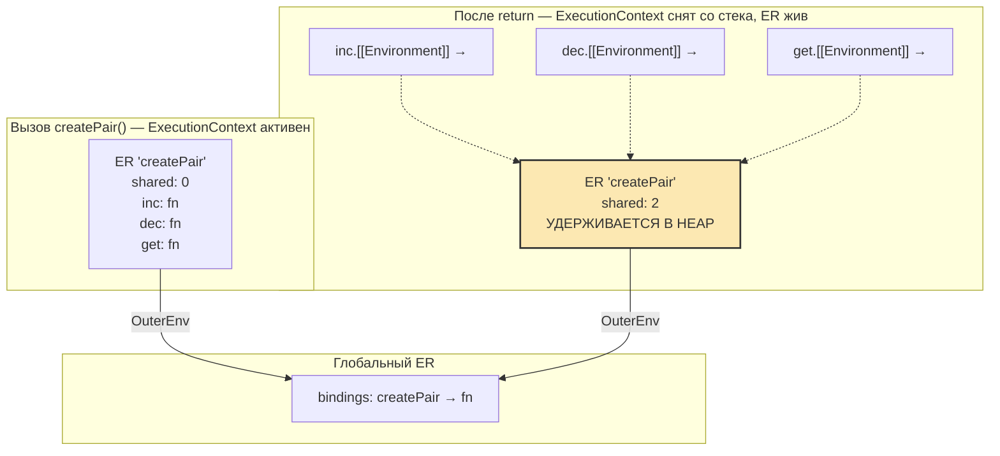

# Замыкания — глубокое погружение

> Этот урок — второй слой под [[06.1b-Что-такое-замыкание]]. Поверхностный урок отвечает на вопрос «что такое замыкание». Этот — на вопрос «что именно происходит в рантайме, чтобы это работало», и закрывает edge cases уровня senior-собеседования.

## Модель: как это работает на самом деле

### Отвергаем модель «снимка»

Распространённая ошибка middle-разработчиков — представлять closure как функцию, «сфотографировавшую» значения переменных в момент создания. Модель кажется интуитивной, потому что для примитивов с `const` поведение совпадает: `const x = 5` в замыкании всегда даёт `5`. Но она ломается на первом edge case с мутацией: если две функции замкнуты на одну переменную и одна её меняет, вторая видит изменение. В модели «снимка» это невозможно — каждая функция должна была бы иметь свою копию.

Правильная модель, выровненная с ECMA-262 §9.1: **closure — это функция плюс ссылка на Environment Record, в котором она была создана**. Не копия значений, не снимок — ссылка на живую структуру в heap. Эта ссылка хранится во внутреннем слоте `[[Environment]]` (в ES3–ES5 — `[[Scope]]`) и не меняется на всём жизненном цикле функции-объекта. Вывод, который сразу убирает половину магии: **все замыкания, созданные в одном окружении, разделяют одну и ту же ссылку**. Изменение переменной через одно замыкание мгновенно видно остальным.

### Спецификационная терминология, переведённая на человеческий

| Термин из ECMA-262 | Что это в рантайме | Аналогия |
|---|---|---|
| **Lexical Environment** | Контекст «где сейчас находится код». В ES2021+ это пара (Environment Record + ссылка на код, который его использует) | Текущая папка, в которой ты работаешь |
| **Environment Record** | Объект в heap с биндингами имя→значение для конкретной области видимости | Содержимое папки: список файлов |
| **Declarative Environment Record** | Тип ER для function/block/module scope. Хранит `let`/`const`/`function`/`class` | Хранилище с фиксированными слотами |
| **Object Environment Record** | Тип ER для global scope и `with`. Биндинги — свойства объекта (`globalThis`) | Куча свойств с произвольными ключами |
| **`[[OuterEnv]]`** | Ссылка одного Environment Record на родительский | Указатель на родительскую папку |
| **`[[Environment]]`** | Внутренний слот функции, указывающий на Environment Record, существовавший на момент её создания | «Паспорт» функции с адресом родного дома |

Каждый блок кода (функция, модуль, глобальный скрипт, блок `{...}` с `let`/`const`) создаёт новый Environment Record. При создании функции движок записывает в `[[Environment]]` ссылку на **текущий** Environment Record — тот, в котором код функции физически написан. При вызове функции создаётся новый Function Environment Record для этой инвокации, его `[[OuterEnv]]` ставится равным `[[Environment]]` функции. Получается цепочка: `[локальный ER вызова] → [ER из [[Environment]]] → [его OuterEnv] → ... → global → null`.

### Scope chain: сборка в два этапа

**Этап 1 — creation time** (`OrdinaryFunctionCreate`, ECMA-262 §10.2.3): функция получает `[[Environment]]` = текущий Environment Record. Это определяет, «где искать» свободные переменные.

**Этап 2 — call time** (`NewFunctionEnvironment`, §10.2.1.1): создаётся новый Function Environment Record для инвокации, его `[[OuterEnv]]` = `[[Environment]]` функции.

Алгоритм разрешения идентификатора (`GetIdentifierReference`, §9.1.2.1): начни с текущего Environment Record, ищи биндинг через `HasBinding(name)`; если не нашёл — иди в `[[OuterEnv]]`; повторяй до `null` (тогда `ReferenceError` при чтении). Первая найденная запись wins. Это объясняет shadowing: локальная переменная скрывает внешнюю с тем же именем.

> **Сноска про терминологию.** До ES2021 спека различала «Lexical Environment» (обёртка) и «Environment Record» (содержимое). В ES2021 их концептуально слили: то, что раньше называли LexicalEnvironment, стало просто Environment Record с полем `[[OuterEnv]]`. Семантика замыканий **не изменилась** — поменялась только терминология. В старых статьях ты будешь видеть `[[Scope]]` и LexicalEnvironment как отдельные сущности; читай их как синонимы Environment Record + `[[OuterEnv]]`.

### Что захватывает closure: ссылку на окружение, не значения

Спецификационно closure захватывает **весь Environment Record целиком**, не только используемые переменные. V8 на практике может оптимизировать и не хранить неиспользуемые переменные (escape analysis для не-захваченных слотов), но в общем случае вся Environment Record остаётся достижимой через `[[Environment]]`. Это объясняет утечки памяти: если closure использует одну маленькую переменную из огромной внешней функции, остальные переменные в ER могут удерживаться в heap.

```javascript
function createPair() {
  let shared = 0;
  return {
    inc: () => ++shared,
    dec: () => --shared,
    get: () => shared,
  };
}

const { inc, dec, get } = createPair();
inc(); inc();
console.log(get()); // 2 — не 0, не «снимок»
dec();
console.log(get()); // 1 — все три функции видят мутации
```

Все три стрелки имеют `[[Environment]]`, указывающий на один и тот же Environment Record вызова `createPair()`. Переменная `shared` — единственная для всех трёх. Это не «каждая функция получила копию `0`»; это «каждая функция получила доступ к живой переменной».

### Диаграмма: жизнь Environment Record после возврата



После завершения `createPair` её Execution Context снят со стека, но Environment Record остаётся в heap, потому что три функции через `[[Environment]]` удерживают на него ссылку. Это и есть механизм closure на уровне спецификации — никакой магии, обычный reachability-based GC.

---

## Пошаговый разбор примера

### Что разбираем: debounce + AbortController + stale closure в React-хуке

Реальная задача: поисковое поле с debounce 300ms, отменой устаревших запросов через `AbortController` и хранением результата. Мы намеренно сделаем версию с багом stale closure, проиграем её в рантайме шаг за шагом и увидим, **где именно** ломается ментальная модель «`useCallback` со стабильной ссылкой решает все проблемы».

```typescript
// useDebouncedSearch.ts
import { useEffect, useRef, useCallback, useState } from 'react';

interface SearchResult {
  items: Array<{ id: string; title: string }>;
  total: number;
}

export function useDebouncedSearch(debounceMs = 300) {
  const [query, setQuery] = useState('');
  const [results, setResults] = useState<SearchResult | null>(null);
  const abortControllerRef = useRef<AbortController | null>(null);

  // Проблемная версия — пустой deps
  const search = useCallback(async (searchQuery: string) => {
    abortControllerRef.current?.abort();
    const controller = new AbortController();
    abortControllerRef.current = controller;

    try {
      const response = await fetch(
        `/api/search?q=${encodeURIComponent(searchQuery)}`,
        { signal: controller.signal },
      );
      const data = await response.json();
      setResults(data);
    } catch (error) {
      if (error instanceof DOMException && error.name === 'AbortError') return;
      throw error;
    }
  }, []); // ← ловушка

  useEffect(() => {
    if (!query.trim()) {
      setResults(null);
      return;
    }
    const timerId = setTimeout(() => search(query), debounceMs);
    return () => clearTimeout(timerId);
  }, [query, debounceMs, search]);

  return { query, setQuery, results };
}
```

### Проигрываем в голове, рендер за рендером

**Рендер 1 — пользователь ввёл «re».** React монтирует компонент. `useState('')` создаёт биндинг `query` в Environment Record рендера 1. `setQuery('re')` из `onChange` планирует ре-рендер. `useCallback` с `[]`: создаётся стрелка, её `[[Environment]]` указывает на ER рендера 1. `useEffect` создаёт callback с `[[Environment]]` на ER рендера 1, в котором `query = ''` (значение **на момент рендера 1**). Эффект вернул cleanup, но впервые он не выполняется.

**Рендер 2 — `query = 're'`.** React вызывает компонент заново. `useState` возвращает текущее значение из своей внутренней `fiber`-структуры. `useCallback`: deps `[]` не изменились, React возвращает **ту же** ссылку на функцию `search` из рендера 1. `[[Environment]]` этой `search` всё ещё указывает на ER рендера 1. `useEffect` сравнивает deps `[query, debounceMs, search]`: `query` поменялся (`''` → `'re'`), эффект пересоздаётся. Cleanup рендера 1 не делает ничего полезного. Новый callback эффекта замкнут на ER рендера 2, где `query = 're'`. `setTimeout` создаёт стрелку `() => search(query)`, её `[[Environment]]` — ER рендера 2.

**Пользователь быстро вводит «react» (за 100ms) → рендер 3.** `query = 'react'`. `useCallback` снова возвращает старую `search` из рендера 1. `useEffect` видит изменение `query`, выполняет cleanup рендера 2: `clearTimeout(timerId)` — таймер с «re» убит, его callback никогда не запустится. Новый эффект создаёт новый таймер, его callback замкнут на ER рендера 3 с `query = 'react'`.

**Прошло 300ms — таймер «react» сработал.** Callback вызывается, `GetIdentifierReference` ищет `query` → находит в ER рендера 3 → значение `'react'`. Вызов `search('react')`. Внутри `search`: `searchQuery = 'react'` (параметр, локальный для этой инвокации, проблема stale closure для **этого** значения отсутствует — оно пришло аргументом). Дальше `abortControllerRef.current?.abort()`: предыдущего контроллера нет, no-op. Создаём `new AbortController`, кладём в `abortControllerRef.current`. **Эта мутация видна всем будущим вызовам `search`**, потому что `abortControllerRef` — мутабельный ref-объект, общий для всех рендеров. `await fetch(...)`: async-функция приостанавливается, её ER замораживается, промис идёт в microtask queue.

**Пока fetch «react» в сети, пользователь вводит «react hooks» → рендер 4.** Новый эффект, новый таймер. Через 300ms таймер «react hooks» срабатывает, вызывает `search('react hooks')`. Внутри: `abortControllerRef.current?.abort()` — отменяет контроллер от **«react»**. Это правильное поведение: запрос «react» получит `AbortError`, его `setResults` не выполнится.

**Где проблема.** Если бы мы не передавали `searchQuery` параметром, а читали `query` из замыкания (`fetch('?q=' + query)`), мы бы попали в stale closure: `search` всегда видел бы `query` из ER рендера 1 (`''`), потому что `useCallback([])` зафиксировал её `[[Environment]]`. Параметр спасает, но это не «`useCallback` решает stale closure» — это «мы вынесли изменчивое значение из замыкания, передав аргументом». Если бы мы внутри `search` ссылались, например, на `debounceMs` напрямую (не через параметр) — снова stale closure.

### Что отсюда забираем

`useCallback([])` стабилизирует **ссылку** на функцию, но не делает закрытые в ней переменные «всегда актуальными». Любая переменная, прочитанная через `[[Environment]]` функции, замороженной с пустым deps, — это значение из того рендера, где функция создавалась. Решений три, и они применимы по контексту:

1. **Параметризовать**: всё изменчивое передавать аргументом — как `searchQuery` в примере.
2. **Включить в deps**: `useCallback(fn, [query, debounceMs])` — функция пересоздастся, ссылка перестанет быть стабильной, но это правильно, если её прокидывают в `useEffect`.
3. **Использовать `useRef`**: положить актуальное значение в `ref.current`, читать в callback через `ref.current`. Это escape hatch из closure chain, потому что `ref` — мутабельный объект, а не лексический биндинг.

---

## Edge cases и почему они себя так ведут

### 1. Stale closure в `useEffect` с пустым deps — самый частый баг в проде

```typescript
function Counter() {
  const [count, setCount] = useState(0);
  useEffect(() => {
    const id = setInterval(() => {
      console.log(count);
      setCount(count + 1);
    }, 1000);
    return () => clearInterval(id);
  }, []);
  return <div>{count}</div>;
}
```

**Ожидание:** 0, 1, 2, 3... **Реальность:** 0, 0, 0, 0... `setCount(count + 1)` всегда ставит `1`. **Объяснение:** callback `setInterval` создан при монтировании. Его `[[Environment]]` указывает на ER рендера 1, где `count = 0`. Эффект не пересоздаётся (`[]`), значит callback не заменяется. Каждую секунду `GetIdentifierReference` находит `count` в этом замороженном ER. Решение — функциональная форма `setCount(c => c + 1)`: React передаёт актуальное значение аргументом, минуя closure chain.

### 2. `useCallback` без deps: handler со stale state

```typescript
function SearchForm({ onSearch }: { onSearch: (q: string) => void }) {
  const [query, setQuery] = useState('');
  const handleSubmit = useCallback(() => {
    onSearch(query);
  }, []); // query не в deps
  return <form onSubmit={handleSubmit}>...</form>;
}
```

**Ожидание:** `onSearch` получает актуальный `query`. **Реальность:** получает первое значение (обычно `''`). **Объяснение:** `handleSubmit` — одна функция на все рендеры, `[[Environment]]` зафиксирован на ER первого рендера. `query` в этом ER — `''`. Стандартная подсказка ESLint-правила `react-hooks/exhaustive-deps` ловит это до прода.

### 3. `for + var + setTimeout`: классический трап

```javascript
for (var i = 0; i < 3; i++) {
  setTimeout(() => console.log(i), 0);
}
// 3, 3, 3
```

**Объяснение:** `var` function-scoped — одна переменная `i` на всю функцию. У всех трёх стрелок `[[Environment]]` указывает на один Function Environment Record, в котором `i` мутируется. К моменту, когда event loop добирается до таймеров, цикл закончился, `i = 3`, `GetIdentifierReference` находит именно это значение. С `let` спека (§14.7.4.7 `CreatePerIterationEnvironment`) явно создаёт новый Declarative Environment Record на каждую итерацию — каждая стрелка замкнута на свой `i`.

### 4. `let` в цикле + `await`: неочевидно работает правильно

```javascript
async function processItems(items) {
  const results = [];
  for (let i = 0; i < items.length; i++) {
    const item = items[i];
    const processed = await transform(item);
    results.push(() => console.log(item.id, processed.status));
  }
  return results;
}
```

**Реальность:** каждая стрелка корректно видит свой `item` и `processed`. **Почему:** `let` создаёт per-iteration ER. `await` приостанавливает async-функцию, но не меняет `[[OuterEnv]]` цепочку — когда выполнение возобновляется, ER той итерации жив, и `processed` записывается именно в него. Стрелка, созданная после `await`, замыкается на этот же ER.

### 5. `this` в обычной функции внутри замыкания: не захватывается лексически

```javascript
const obj = {
  value: 42,
  getRegular() {
    return function () { return this.value; };
  },
  getArrow() {
    return () => this.value;
  },
};

const regular = obj.getRegular();
const arrow = obj.getArrow();
console.log(regular()); // undefined (или TypeError в strict mode)
console.log(arrow());   // 42
```

**Объяснение:** `this` у обычной функции определяется call site (для свободного вызова — `undefined` в strict, `globalThis` в sloppy). У стрелки `[[ThisMode]] = lexical`, своего `this`-биндинга нет — он берётся через `[[OuterEnv]]` из ER, где стрелка создана, а там `this = obj` (метод вызывали как `obj.getArrow()`).

### 6. Утечка памяти через event listener на долгоживущем DOM-узле

```typescript
function setupGlobalShortcut(handler: (e: KeyboardEvent) => void) {
  const cache = new Map<string, unknown>(); // потенциально большой
  document.addEventListener('keydown', (e) => {
    if (e.key === 'Escape') handler(e);
  });
  return {
    preload: (key: string, value: unknown) => cache.set(key, value),
  };
}
```

**Проблема:** listener на `document` живёт до закрытия вкладки. Его `[[Environment]]` держит ER `setupGlobalShortcut`, в котором лежит `cache`. Даже если внешний код потерял ссылку на возвращённый объект, `cache` остаётся достижимым через listener → его `[[Environment]]` → ER. **Видно в DevTools:** Memory → Heap snapshot → найди `Map`, в Retainers увидишь путь через `function (anonymous)` с `[[FunctionLocation]]` в `setupGlobalShortcut`. **Фикс:** возвращать `dispose`-функцию с `removeEventListener` и звать её при размонтировании.

### 7. `setTimeout` с большим объектом: retention до срабатывания

```javascript
function scheduleProcessing(data) {
  const processed = heavyTransform(data); // 50MB
  setTimeout(() => console.log('Ready', processed.length), 60_000);
}
```

**Проблема:** callback `setTimeout` через `[[Environment]]` держит ER, где живёт `processed`. Минута в heap — не катастрофа, но показывает паттерн: **любой long-lived таймер замыкает всю окружающую функцию**. Если убрать `console.log` и `processed` из замыкания не нужен — его всё равно будет держать спецификация (V8 может оптимизировать, но не гарантирует). Минимизируй захват: вытащи нужное в отдельный const, или передавай аргументом — `setTimeout((p) => ..., 60_000, processed)`, тогда `processed` не попадает в `[[Environment]]` callback'а.

### 8. Closure-instance: «приватные» переменные через factory шарят меньше, чем кажется

```javascript
function createWidgetFactory() {
  let id = 0;
  const sharedConfig = { theme: 'dark' };
  return {
    createWidget: (name) => ({ id: ++id, name, config: sharedConfig }),
    updateTheme: (theme) => { sharedConfig.theme = theme; },
  };
}
```

**Ожидание:** каждый виджет — независимый. **Реальность:** `updateTheme` меняет `theme` у всех виджетов. **Объяснение:** `sharedConfig` — один объект в ER factory. `createWidget` возвращает ссылку, не копию. Это не баг замыканий — это «closure даёт shared access, не automatic copy-on-write». Хочешь независимости — `config: { ...sharedConfig }` в момент создания.

### 9. Async race condition: `cancelled`-флаг через замыкание

```typescript
function useLatestData(url: string) {
  const [data, setData] = useState<unknown>(null);
  useEffect(() => {
    let cancelled = false;
    fetch(url).then((r) => r.json()).then((result) => {
      if (!cancelled) setData(result);
    });
    return () => { cancelled = true; };
  }, [url]);
  return data;
}
```

**Что работает:** при быстрой смене `url` cleanup ставит `cancelled = true` для **прошлого** эффекта. Promise-chain прошлого эффекта замкнут на тот же `cancelled` через `[[Environment]]` — он увидит `true` и не вызовет `setData`. **Что не работает:** реально fetch-запрос всё равно ушёл и вернётся (сожжёт трафик и ресурсы сервера). Для отмены сетевого запроса нужен `AbortController.signal`. Замыкание здесь решает race condition в state, не race condition в сети.

### 10. Indirect eval: исполняется в глобальном окружении

```javascript
const eval2 = eval;

(function () {
  const secret = 42;
  eval('console.log(secret)');   // 42
  eval2('console.log(secret)');  // ReferenceError
})();
```

**Объяснение:** спека (§19.2.1) различает direct eval (вызов через идентификатор `eval`) и indirect eval (любой другой способ). Direct eval запускается в `[[OuterEnv]]` вызывающего — видит `secret`. Indirect eval создаёт собственный ER с `[[OuterEnv]] = global`, локальные переменные не видны. Это позволило JIT-движкам оптимизировать функции, не делая pessimistic-предположение «где-то в коде может быть eval, который читает мои локалы». Senior-вопрос на собеседовании, если кандидат спорит, что «eval — это просто eval».

### 11. `useRef` как escape hatch из closure chain

```typescript
function useStableCallback<T extends (...args: any[]) => any>(fn: T): T {
  const ref = useRef(fn);
  useEffect(() => { ref.current = fn; });
  return useCallback(((...args) => ref.current(...args)) as T, []);
}
```

**Идея:** возвращаемая функция стабильна по ссылке (deps `[]`), но при каждом рендере мы обновляем `ref.current` на свежий `fn`. Внутренняя стрелка читает `ref.current` — **не лексическую переменную**, а свойство мутабельного объекта. `[[Environment]]` стрелки заморожен, но `ref` — это ссылка на объект, и `ref.current` каждый раз читается заново. Получаем «всегда актуальный handler со стабильной ссылкой» — паттерн, который TC39 хочет стандартизировать как `useEffectEvent`. **Подвох:** в строгих типах `(...args: any[]) => any` — нет нормального способа сохранить generic-сигнатуру `T` без any-каста; это известное ограничение TS, не косяк паттерна.

### 12. V8 hidden allocation: closure «сплющивание» и его границы

```javascript
function hotPath(items) {
  return items.map((x) => x * 2);
}
```

V8 может **не аллоцировать** Context-объект (V8-овский аналог Environment Record) для этой стрелки: она не ссылается на свободные переменные, нет `eval`/`with` в окружении, не используется как конструктор. Это «closure flattening». Стоит добавить хоть одну захваченную переменную:

```javascript
function hotPath(items) {
  const multiplier = 2;
  return items.map((x) => x * multiplier);
}
```

— и V8 обязан создать Context. На hot-path с миллионами итераций разница может стоить десятки процентов. На UI-коде — несущественно, и оптимизировать «closure-free» вариант ради призрачных миллисекунд — преждевременная оптимизация. Знать об этом полезно для двух кейсов: (1) бенчмарки, где closure-аллокация реально мешает; (2) объяснение, почему «всё то же самое, но через `bind` или вынесенную функцию» иногда измеримо быстрее.

### 13. Closure в DevTools: панель Scope раскрывает захват

Поставь breakpoint внутри замыкания, открой DevTools → Sources → панель Scope. Увидишь иерархию: `Local`, `Closure (имя_внешней_функции)`, `Closure (...)`, `Global`. Каждая «Closure» — отдельный Environment Record по цепочке `[[OuterEnv]]`. Ты можешь развернуть любой и увидеть его биндинги — ровно то, что закрытая функция увидит через `GetIdentifierReference`. Можно даже изменить значение и продолжить выполнение. Это убивает 80% догадок «а замкнулась ли там та переменная или другая».

---

## Контр-примеры и распространённые мифы

**Миф: «Замыкания — медленные, не используй их в hot loop».**
**Реальность:** в современном V8 closure-аллокация копеечная, и движок умеет её elide'ить, если переменные не захватываются. Замеры (mrale.ph, neversaw.us) показывают, что разница между closure и обычной функцией — десятки наносекунд, и она исчезает при escape analysis. Миф жив, потому что в эпоху Crockford и IE6 это было правдой.
**Где живёт:** старые статьи 2005–2012, советы «не создавай функцию внутри map».

**Миф: «Closure всегда удерживает захваченные переменные навечно».**
**Реальность:** closure удерживает Environment Record, **пока сам closure достижим**. Как только все ссылки на функцию исчезают, GC собирает и функцию, и её ER. Эксперимент Jake Archibald (2024) показывает, что таймер с захваченным `ArrayBuffer` корректно освобождает память после срабатывания.
**Где живёт:** статьи в духе «closures cause memory leaks» без оговорок.

**Миф: «`useCallback` решает stale closure».**
**Реальность:** `useCallback` стабилизирует ссылку, но не делает захваченные переменные «живыми». При неполных deps функция возвращается та же — со старым `[[Environment]]`. Stale closure именно в этом и состоит.
**Где живёт:** статьи «оптимизация React-перерендеров через useCallback» без обсуждения deps.

**Миф: «Замыкание делает копию переменной».**
**Реальность:** захватывается ссылка на Environment Record. Все функции, замкнутые на один ER, видят одни и те же мутации. Это причина бага `for + var + setTimeout` и одновременно — фундамент паттерна module/factory.
**Где живёт:** объяснения вроде «функция запоминает значение переменной на момент создания» — частично верно для immutable примитивов, неверно вообще.

**Миф: «Все функции — замыкания, поэтому термин бесполезен».**
**Реальность:** формально да, у каждой функции есть `[[Environment]]`. Практически термин полезен, когда функция читает или пишет свободные переменные — там, где поведение становится неочевидным. На собеседовании можно дать обе формулировки и объяснить, что на уровне `[[Environment]]` разницы нет, а на уровне обсуждения багов — есть.
**Где живёт:** холивары на StackOverflow и в комментариях к MDN.

**Миф: «Стрелочные функции захватывают `this` в замыкании».**
**Реальность:** стрелка **не имеет** своего `this`-биндинга. Когда внутри стрелки пишут `this`, `GetIdentifierReference` идёт через `[[OuterEnv]]` и находит `this` в ближайшем enclosing function/method ER. Это не «захват в момент создания», а «отсутствие собственного слота, поэтому ищется как обычная переменная». Разница важна для объяснения, почему `bind`/`call`/`apply` на стрелке игнорируются: некуда привязывать.
**Где живёт:** объяснения «стрелка fix'ит `this`», без уточнения механики.

**Миф: «Приватность через closure надёжнее, чем через `#private` поля».**
**Реальность:** оба варианта дают приватность, но разными механизмами. Closure прячет переменную в недоступном извне ER. `#private` — синтаксическая приватность, проверяемая на уровне парсера; на уровне рантайма поле существует как PrivateName-слот объекта. Через `Reflect`/`Proxy` ни то, ни другое штатно не достать. Closure тяжелее по памяти (отдельный ER на инстанс), `#private` легче (шарит prototype-методы между инстансами). Для классов с наследованием — `#private`. Для функциональных модулей — closure. «Надёжнее» — миф из эпохи до class fields.
**Где живёт:** обсуждения в духе «настоящие приватные поля только через closure».

---

## Связи с другими темами

**[[06.1a-Лексическая-область-видимости]] — фундамент.** Замыкания невозможно объяснить без понимания того, что scope в JS определяется по тексту программы (lexical), а не по стеку вызовов (dynamic). `[[Environment]]` функции фиксируется на момент **парсинга/создания**, не на момент вызова — это и есть «лексический» в lexical environment. Если в голове путаница «откуда берётся переменная», возвращайся в этот урок.

**[[06.5a-Event-loop-очереди]] и [[06.3d-async-await]] — почему async-замыкания вообще работают.** Каждый раз, когда ты пишешь `setTimeout`, `addEventListener`, `.then`, `await`, ты передаёшь функцию, которая будет вызвана **в другом тике event loop**. Без замыкания она не помнила бы, в каком контексте была создана. Все классические async-баги (`for+var+setTimeout`, stale closure в interval, race condition в `useEffect`) — это коллизия «функция создана в одном тике с одним ER, вызвана в другом тике, когда состояние ER уже мутировано».

**[[09.6-useEffect]] и [[10.4-useMemo-useCallback-useRef]] — React держится на замыканиях.** Каждый рендер создаёт новые closure-callbacks, замкнутые на state/props этого рендера. Хуки (`useEffect`, `useCallback`, `useMemo`) — это механизм решения, какой именно closure из какого рендера React должен запустить или закэшировать. Без модели «callback = функция + ER рендера N» React-хуки превращаются в магию: непонятно, почему `setInterval` логирует `0`, почему `useCallback` не помогает, почему `useRef` — escape hatch. С моделью — все эти баги становятся следствием одной ментальной операции: «найди ER, который эта функция захватила».

**[[10.5-Кастомные-хуки]] — паттерны замыканий, обёрнутые в хуки.** `useDebouncedSearch`, `useEventListener`, `useStableCallback` (из edge case 11) — это все variations на тему «как управлять замыканиями в render-цикле». Кастомный хук = factory function, возвращающий closure-инстансы; React-специфика — только в том, что factory гоняется на каждый рендер.

**DevTools Memory profiling.** Утечки в SPA на 90% проходят через цепочку `что-то долгоживущее (DOM listener, interval, глобальный кэш) → closure → его [[Environment]] → объекты в ER`. Лечение — не «убрать closure», а разорвать долгоживущую ссылку. Ментальная модель ER + `[[Environment]]` напрямую переносится на чтение Retainers в Heap snapshot.

---

## Вопросы для самопроверки

<details><summary>1. Объясни, как JS разрешает идентификатор `foo` по спецификации.</summary>

Спека вызывает `GetIdentifierReference(env, "foo", strict)` (§9.1.2.1). Алгоритм: проверяет `env.HasBinding("foo")`; если `true` — возвращает Reference на этот ER; если `false` — берёт `env.[[OuterEnv]]` и рекурсивно повторяет; при `null` возвращает unresolvable Reference (превратится в `ReferenceError` при чтении). Это и есть «scope chain lookup» — повторное применение алгоритма по связному списку Environment Records.
</details>

<details><summary>2. Что именно сохраняется в `[[Environment]]` функции в момент создания?</summary>

При исполнении `OrdinaryFunctionCreate`/`InstantiateOrdinaryFunctionExpression` (§10.2.3 / §15.2.4) спека передаёт `env = текущий LexicalEnvironment` и записывает его в `[[Environment]]` слот функции. На момент **вызова** `NewFunctionEnvironment` создаёт новый Function ER и ставит его `[[OuterEnv]] = func.[[Environment]]`. То есть функция «помнит» цепочку ER, существовавшую на момент её создания, и продолжает её на момент вызова.
</details>

<details><summary>3. Все ли функции в JS — замыкания? (вопрос-ловушка)</summary>

Формально — да: у каждой функции есть `[[Environment]]`, она «закрывает» окружающий ER, даже если не использует ни одной свободной переменной. Прагматически термин обычно применяют к функциям, реально читающим/пишущим свободные переменные, потому что только там поведение становится неочевидным. На собеседовании корректно сказать обе формулировки и связать их через `[[Environment]]`. Ловушка — отвечать категорично «да» или «нет» без объяснения механизма.
</details>

<details><summary>4. Почему `for (var i...) setTimeout(...)` логирует одно и то же значение?</summary>

`var` function-scoped: один биндинг `i` в одном Function ER на всю функцию. Все callback'и `setTimeout` через `[[Environment]]` указывают на этот ER. К моменту, когда event loop вызывает callback'и, цикл уже завершился, `i` равно конечному значению. `GetIdentifierReference` в каждом callback'е находит один и тот же биндинг. С `let` спека (§14.7.4.7 `CreatePerIterationEnvironment`) копирует значение в новый Declarative ER на каждой итерации.
</details>

<details><summary>5. Замыкания всегда вызывают memory leak?</summary>

Нет. Closure удерживает свой ER, **пока сам closure достижим**. Если на функцию никто не ссылается, GC соберёт и функцию, и её ER, и захваченные объекты. Утечки случаются, когда closure достижим из чего-то долгоживущего: незакрытые `setInterval`, не снятые `addEventListener`, кэши в Map по неочищаемым ключам, глобальные переменные. Лечение — не «не используй closure», а «обрывай долгоживущие ссылки».
</details>

<details><summary>6. Что такое stale closure в React и как его распознать?</summary>

Stale closure — функция, созданная в каком-то рендере и запомнившая state/props **того** рендера, продолжает использоваться позже, когда состояние уже изменилось. Классические места: `useEffect` с пустым deps и интервалом внутри; `useCallback` без нужных deps, прокинутый в child; event handler в long-lived `addEventListener`. Распознать: «функция читает переменную из замыкания и видит старое значение, хотя UI показывает новое». Линтер `react-hooks/exhaustive-deps` ловит большую часть таких ошибок.
</details>

<details><summary>7. Два способа починить stale closure в `useEffect` с интервалом.</summary>

(а) Функциональный апдейт: `setCount(c => c + 1)` — React передаёт актуальное значение аргументом, замыкание не нужно.
(б) Включить state в deps: `useEffect(() => { ... }, [count])` — эффект пересоздаётся при изменении `count`, новый callback замкнут на свежий ER.
(в) (Бонус) `useRef`: положить `count` в `ref.current`, в callback читать `ref.current` — эта переменная не лексическая, а свойство мутабельного объекта.
</details>

<details><summary>8. Решает ли `useCallback` сам по себе stale closure? (ловушка)</summary>

Нет. `useCallback` мемоизирует функцию по deps. Если deps неполные — возвращается **та же** функция со **старым** `[[Environment]]`, и stale closure остаётся. Ловушка в том, что `useCallback` ассоциируют с «оптимизацией» и думают, что он «фиксит» свежесть данных. Правильно: `useCallback` управляет identity ссылки, а свежесть данных — это про корректные deps или вынос значений в `useRef`/аргументы.
</details>

<details><summary>9. В чём разница между direct и indirect eval с точки зрения замыканий?</summary>

Direct eval (`eval(...)` через идентификатор `eval` напрямую) исполняется в `[[OuterEnv]]` вызывающего: видит локальные переменные, может их читать и писать. Indirect eval (`(0, eval)("...")`, `eval2("...")` где `eval2 = eval`) исполняется в **глобальном** ER: локальные переменные не видны. Спека развела их, чтобы движки могли оптимизировать функции, не предполагая «где-то здесь может быть eval, который трогает мои локалы». На собеседовании — хороший индикатор, что кандидат читал спеку.
</details>

<details><summary>10. Замыкание vs `#private` поле для приватности — что выбрать?</summary>

Closure: state живёт в ER factory-функции, доступен только через возвращённые методы. Каждый инстанс — отдельный ER (тяжелее по памяти). Хорош для функциональных модулей и factory-паттернов.
`#private`: state — поле объекта, доступ запрещён парсером. Методы шарятся через prototype (легче по памяти). Хорош для классов и наследования.
Оба дают одинаковую гарантию приватности через стандартные API. Выбор — по стилю и по тому, нужна ли тебе class-семантика.
</details>

<details><summary>11. Почему `setInterval` с захваченным state в `useEffect` пишет один и тот же лог, но `setState` всё-таки иногда обновляет UI?</summary>

`console.log(count)` читает `count` из захваченного ER рендера 1 — всегда `0`. А `setCount(count + 1)` ставит state равным `0 + 1 = 1`, что вызывает ре-рендер и обновляет UI. Но эффект **не пересоздаётся** (deps `[]`), интервал тот же, callback тот же, его ER тот же — следующий тик опять `count = 0` в замыкании, опять `setCount(0 + 1)`. UI скачет с `0` на `1` и стопорится: батчинг видит, что state не меняется, и перестаёт ре-рендерить. Этот вопрос — отличный тест на понимание разницы «значение state» vs «значение в closure».
</details>

<details><summary>12. Как DevTools помогает понять, что захвачено замыканием?</summary>

Sources → breakpoint внутри функции → панель Scope. Под Local идут разделы Closure для каждого внешнего ER, который функция реально захватила (V8 уже отфильтровала неиспользуемые через escape analysis, поэтому видишь только то, что движок счёл нужным сохранить). Можно развернуть и посмотреть значения, изменить их, продолжить выполнение. Это обрывает 80% догадок «там точно стейл-значение или мне кажется».
</details>

<details><summary>13. Почему `with` запрещён в strict mode — что именно ломается?</summary>

`with(obj) { ... }` пихает `obj` в начало scope chain как Object Environment Record. Имена внутри блока могут резолвиться через свойства `obj` — но это решается **в рантайме**, по shape объекта. JIT-компилятору и статическому анализу нельзя сказать, какой биндинг использует данный идентификатор, пока не выполнится `with`. Это ломает оптимизации идентификаторов и замыканий. В strict mode `with` запрещён синтаксически — TC39 решил, что цена слишком высока. Хороший вопрос на понимание «почему динамические scope-фичи плохо живут с лексическими замыканиями».
</details>

---

## Что почитать

- **[ECMA-262, §9.1 Environment Records](https://tc39.es/ecma262/#sec-environment-records)** — primary source. Читай §9.1.1 (типы ER), §9.1.2.1 (`GetIdentifierReference`), §10.2.3 (`OrdinaryFunctionCreate`). Senior, ~30 минут.
- **[MDN — Closures](https://developer.mozilla.org/en-US/docs/Web/JavaScript/Closures)** — базовая канон-формулировка «function bundled with lexical environment». Хорошо как референс на собеседование. Junior+, 15 минут.
- **[Vyacheslav Egorov — Grokking V8 closures for fun (and profit?)](https://mrale.ph/blog/2012/09/23/grokking-v8-closures-for-fun.html)** — как V8 представляет замыкания через Context-объекты, что оптимизируется, что нет. Senior, 40 минут.
- **[Jake Archibald — Garbage collection and closures](https://jakearchibald.com/2024/garbage-collection-and-closures/)** (2024) — разбирает миф «closure = leak» через эксперименты с DevTools Memory. Middle, 20 минут.
- **[You Don't Know JS Yet — Scope & Closures (2nd ed)](https://github.com/getify/You-Dont-Know-JS/tree/2nd-ed/scope-closures)** — главы 5–7. Самый плотный single-source по теме, на спецификационном уровне без занудства. Middle/Senior, 3–4 часа.
- **[Dmitry Soshnikov — ECMA-262-5 in Detail. Lexical Environments](http://dmitrysoshnikov.com/ecmascript/es5-chapter-3-2-lexical-environments-ecmascript-implementation/)** — мост между спекой и интуицией, объясняет environment frames языко-агностически. Senior, 40 минут.
- **[Developer Way — Fantastic closures and how to find them in React](https://www.developerway.com/posts/fantastic-closures)** — лучший single-source по stale closures в React-хуках, с конкретными edge cases и решениями. Middle, 30 минут.
- **[HN: JavaScript garbage collection and closures](https://news.ycombinator.com/item?id=39698537)** — обсуждение Archibald-статьи с участием инженеров движков, с подробностями про shared closure records и direct/indirect eval. Senior, 30 минут.

---

[[06.1c-Практика-замыканий|→ Дальше: Практика замыканий — паттерны и инкапсуляция]]
